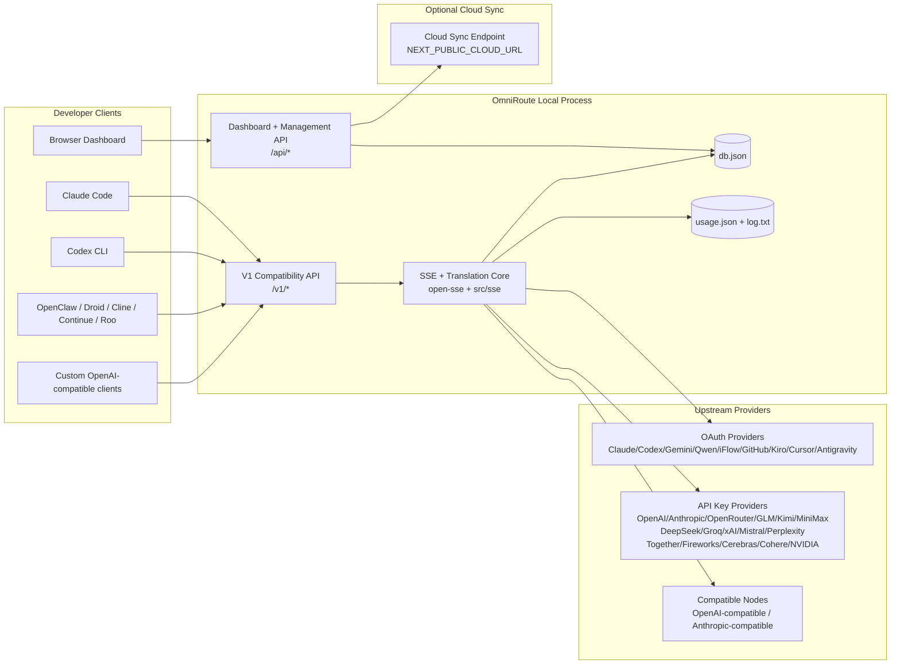
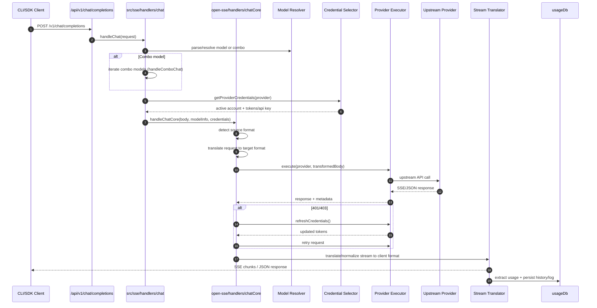
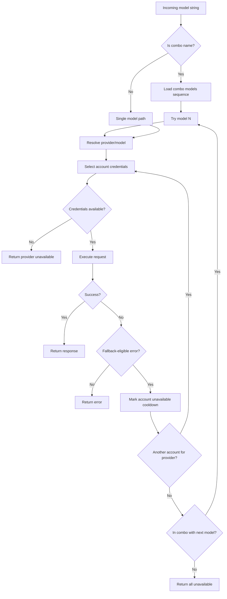
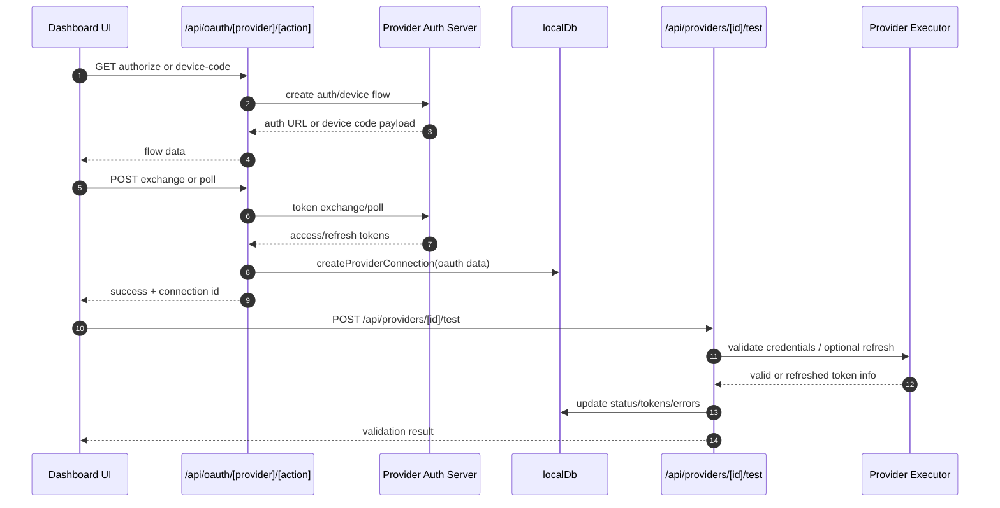
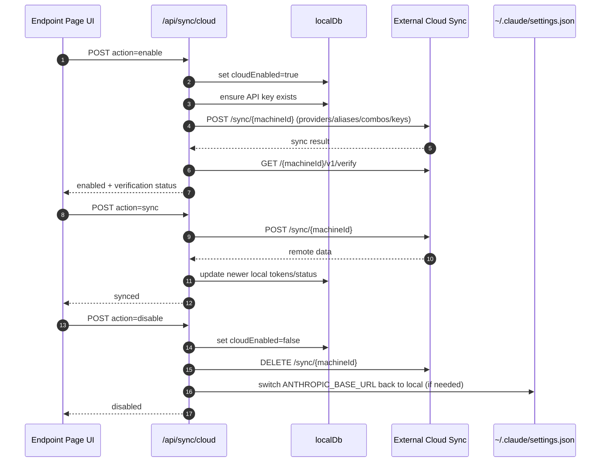
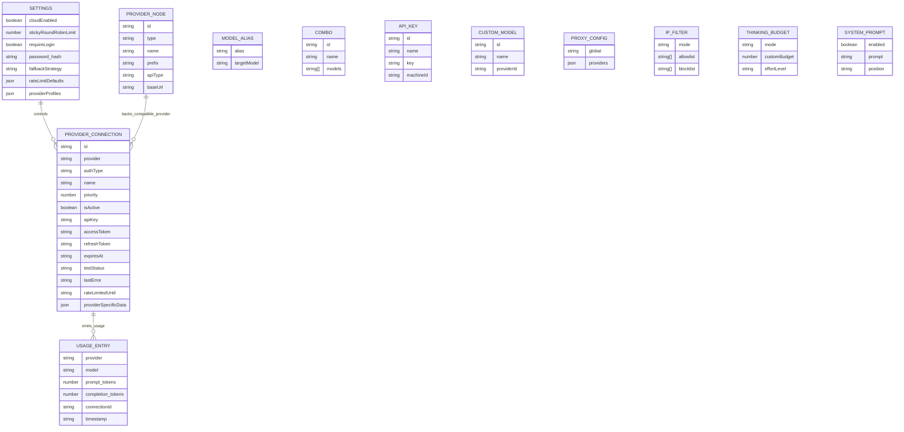
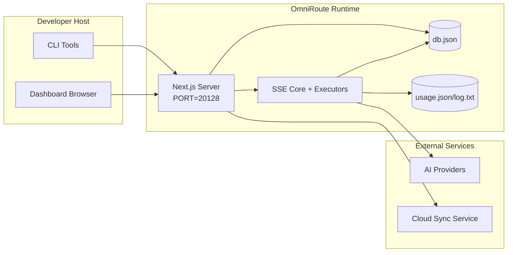

# OmniRoute Architecture

_Last updated: 2026-02-18_

## Executive Summary

OmniRoute is a local AI routing gateway and dashboard built on Next.js.
It provides a single OpenAI-compatible endpoint (`/v1/*`) and routes traffic across multiple upstream providers with translation, fallback, token refresh, and usage tracking.

Core capabilities:

- OpenAI-compatible API surface for CLI/tools (28 providers)
- Request/response translation across provider formats
- Model combo fallback (multi-model sequence)
- Account-level fallback (multi-account per provider)
- OAuth + API-key provider connection management
- Embedding generation via `/v1/embeddings` (6 providers, 9 models)
- Image generation via `/v1/images/generations` (4 providers, 9 models)
- Think tag parsing (`<think>...</think>`) for reasoning models
- Response sanitization for strict OpenAI SDK compatibility
- Role normalization (developer→system, system→user) for cross-provider compatibility
- Structured output conversion (json_schema → Gemini responseSchema)
- Local persistence for providers, keys, aliases, combos, settings, pricing
- Usage/cost tracking and request logging
- Optional cloud sync for multi-device/state sync
- IP allowlist/blocklist for API access control
- Thinking budget management (passthrough/auto/custom/adaptive)
- Global system prompt injection
- Session tracking and fingerprinting
- Per-account enhanced rate limiting with provider-specific profiles
- Circuit breaker pattern for provider resilience
- Anti-thundering herd protection with mutex locking
- Signature-based request deduplication cache
- Domain layer: model availability, cost rules, fallback policy, lockout policy
- Domain state persistence (SQLite write-through cache for fallbacks, budgets, lockouts, circuit breakers)
- Policy engine for centralized request evaluation (lockout → budget → fallback)
- Request telemetry with p50/p95/p99 latency aggregation
- Correlation ID (X-Request-Id) for end-to-end tracing
- Compliance audit logging with opt-out per API key
- Eval framework for LLM quality assurance
- Resilience UI dashboard with real-time circuit breaker status
- Modular OAuth providers (12 individual modules under `src/lib/oauth/providers/`)

Primary runtime model:

- Next.js app routes under `src/app/api/*` implement both dashboard APIs and compatibility APIs
- A shared SSE/routing core in `src/sse/*` + `open-sse/*` handles provider execution, translation, streaming, fallback, and usage

## Scope and Boundaries

### In Scope

- Local gateway runtime
- Dashboard management APIs
- Provider authentication and token refresh
- Request translation and SSE streaming
- Local state + usage persistence
- Optional cloud sync orchestration

### Out of Scope

- Cloud service implementation behind `NEXT_PUBLIC_CLOUD_URL`
- Provider SLA/control plane outside local process
- External CLI binaries themselves (Claude CLI, Codex CLI, etc.)

## High-Level System Context



## Core Runtime Components

## 1) API and Routing Layer (Next.js App Routes)

Main directories:

- `src/app/api/v1/*` and `src/app/api/v1beta/*` for compatibility APIs
- `src/app/api/*` for management/configuration APIs
- Next rewrites in `next.config.mjs` map `/v1/*` to `/api/v1/*`

Important compatibility routes:

- `src/app/api/v1/chat/completions/route.ts`
- `src/app/api/v1/messages/route.ts`
- `src/app/api/v1/responses/route.ts`
- `src/app/api/v1/models/route.ts` — includes custom models with `custom: true`
- `src/app/api/v1/embeddings/route.ts` — embedding generation (6 providers)
- `src/app/api/v1/images/generations/route.ts` — image generation (4+ providers incl. Antigravity/Nebius)
- `src/app/api/v1/messages/count_tokens/route.ts`
- `src/app/api/v1/providers/[provider]/chat/completions/route.ts` — dedicated per-provider chat
- `src/app/api/v1/providers/[provider]/embeddings/route.ts` — dedicated per-provider embeddings
- `src/app/api/v1/providers/[provider]/images/generations/route.ts` — dedicated per-provider images
- `src/app/api/v1beta/models/route.ts`
- `src/app/api/v1beta/models/[...path]/route.ts`

Management domains:

- Auth/settings: `src/app/api/auth/*`, `src/app/api/settings/*`
- Providers/connections: `src/app/api/providers*`
- Provider nodes: `src/app/api/provider-nodes*`
- Custom models: `src/app/api/provider-models` (GET/POST/DELETE)
- Model catalog: `src/app/api/models/catalog` (GET)
- Proxy config: `src/app/api/settings/proxy` (GET/PUT/DELETE) + `src/app/api/settings/proxy/test` (POST)
- OAuth: `src/app/api/oauth/*`
- Keys/aliases/combos/pricing: `src/app/api/keys*`, `src/app/api/models/alias`, `src/app/api/combos*`, `src/app/api/pricing`
- Usage: `src/app/api/usage/*`
- Sync/cloud: `src/app/api/sync/*`, `src/app/api/cloud/*`
- CLI tooling helpers: `src/app/api/cli-tools/*`
- IP filter: `src/app/api/settings/ip-filter` (GET/PUT)
- Thinking budget: `src/app/api/settings/thinking-budget` (GET/PUT)
- System prompt: `src/app/api/settings/system-prompt` (GET/PUT)
- Sessions: `src/app/api/sessions` (GET)
- Rate limits: `src/app/api/rate-limits` (GET)
- Resilience: `src/app/api/resilience` (GET/PATCH) — provider profiles, circuit breaker, rate limit state
- Resilience reset: `src/app/api/resilience/reset` (POST) — reset breakers + cooldowns
- Cache stats: `src/app/api/cache/stats` (GET/DELETE)
- Model availability: `src/app/api/models/availability` (GET/POST)
- Telemetry: `src/app/api/telemetry/summary` (GET)
- Budget: `src/app/api/usage/budget` (GET/POST)
- Fallback chains: `src/app/api/fallback/chains` (GET/POST/DELETE)
- Compliance audit: `src/app/api/compliance/audit-log` (GET)
- Evals: `src/app/api/evals` (GET/POST), `src/app/api/evals/[suiteId]` (GET)
- Policies: `src/app/api/policies` (GET/POST)

## 2) SSE + Translation Core

Main flow modules:

- Entry: `src/sse/handlers/chat.ts`
- Core orchestration: `open-sse/handlers/chatCore.ts`
- Provider execution adapters: `open-sse/executors/*`
- Format detection/provider config: `open-sse/services/provider.ts`
- Model parse/resolve: `src/sse/services/model.ts`, `open-sse/services/model.ts`
- Account fallback logic: `open-sse/services/accountFallback.ts`
- Translation registry: `open-sse/translator/index.ts`
- Stream transformations: `open-sse/utils/stream.ts`, `open-sse/utils/streamHandler.ts`
- Usage extraction/normalization: `open-sse/utils/usageTracking.ts`
- Think tag parser: `open-sse/utils/thinkTagParser.ts`
- Embedding handler: `open-sse/handlers/embeddings.ts`
- Embedding provider registry: `open-sse/config/embeddingRegistry.ts`
- Image generation handler: `open-sse/handlers/imageGeneration.ts`
- Image provider registry: `open-sse/config/imageRegistry.ts`
- Response sanitization: `open-sse/handlers/responseSanitizer.ts`
- Role normalization: `open-sse/services/roleNormalizer.ts`

Services (business logic):

- Account selection/scoring: `open-sse/services/accountSelector.ts`
- Context lifecycle management: `open-sse/services/contextManager.ts`
- IP filter enforcement: `open-sse/services/ipFilter.ts`
- Session tracking: `open-sse/services/sessionManager.ts`
- Request deduplication: `open-sse/services/signatureCache.ts`
- System prompt injection: `open-sse/services/systemPrompt.ts`
- Thinking budget management: `open-sse/services/thinkingBudget.ts`
- Wildcard model routing: `open-sse/services/wildcardRouter.ts`
- Rate limit management: `open-sse/services/rateLimitManager.ts`
- Circuit breaker: `open-sse/services/circuitBreaker.ts`

Domain layer modules:

- Model availability: `src/lib/domain/modelAvailability.ts`
- Cost rules/budgets: `src/lib/domain/costRules.ts`
- Fallback policy: `src/lib/domain/fallbackPolicy.ts`
- Combo resolver: `src/lib/domain/comboResolver.ts`
- Lockout policy: `src/lib/domain/lockoutPolicy.ts`
- Policy engine: `src/domain/policyEngine.ts` — centralized lockout → budget → fallback evaluation
- Error codes catalog: `src/lib/domain/errorCodes.ts`
- Request ID: `src/lib/domain/requestId.ts`
- Fetch timeout: `src/lib/domain/fetchTimeout.ts`
- Request telemetry: `src/lib/domain/requestTelemetry.ts`
- Compliance/audit: `src/lib/domain/compliance/index.ts`
- Eval runner: `src/lib/domain/evalRunner.ts`
- Domain state persistence: `src/lib/db/domainState.ts` — SQLite CRUD for fallback chains, budgets, cost history, lockout state, circuit breakers

OAuth provider modules (12 individual files under `src/lib/oauth/providers/`):

- Registry index: `src/lib/oauth/providers/index.ts`
- Individual providers: `claude.ts`, `codex.ts`, `gemini.ts`, `antigravity.ts`, `iflow.ts`, `qwen.ts`, `kimi-coding.ts`, `github.ts`, `kiro.ts`, `cursor.ts`, `kilocode.ts`, `cline.ts`
- Thin wrapper: `src/lib/oauth/providers.ts` — re-exports from individual modules

## 3) Persistence Layer

Primary state DB:

- `src/lib/localDb.ts`
- file: `${DATA_DIR}/db.json` (or `$XDG_CONFIG_HOME/omniroute/db.json` when set, else `~/.omniroute/db.json`)
- entities: providerConnections, providerNodes, modelAliases, combos, apiKeys, settings, pricing, **customModels**, **proxyConfig**, **ipFilter**, **thinkingBudget**, **systemPrompt**

Usage DB:

- `src/lib/usageDb.ts`
- files: `${DATA_DIR}/usage.json`, `${DATA_DIR}/log.txt`, `${DATA_DIR}/call_logs/`
- follows same base directory policy as `localDb` (`DATA_DIR`, then `XDG_CONFIG_HOME/omniroute` when set)
- decomposed into focused sub-modules: `migrations.ts`, `usageHistory.ts`, `costCalculator.ts`, `usageStats.ts`, `callLogs.ts`

Domain State DB (SQLite):

- `src/lib/db/domainState.ts` — CRUD operations for domain state
- Tables (created in `src/lib/db/core.ts`): `domain_fallback_chains`, `domain_budgets`, `domain_cost_history`, `domain_lockout_state`, `domain_circuit_breakers`
- Write-through cache pattern: in-memory Maps are authoritative at runtime; mutations are written synchronously to SQLite; state is restored from DB on cold start

## 4) Auth + Security Surfaces

- Dashboard cookie auth: `src/proxy.ts`, `src/app/api/auth/login/route.ts`
- API key generation/verification: `src/shared/utils/apiKey.ts`
- Provider secrets persisted in `providerConnections` entries
- Outbound proxy support via `open-sse/utils/proxyFetch.ts` (env vars) and `open-sse/utils/networkProxy.ts` (configurable per-provider or global)

## 5) Cloud Sync

- Scheduler init: `src/lib/initCloudSync.ts`, `src/shared/services/initializeCloudSync.ts`
- Periodic task: `src/shared/services/cloudSyncScheduler.ts`
- Control route: `src/app/api/sync/cloud/route.ts`

## Request Lifecycle (`/v1/chat/completions`)



## Combo + Account Fallback Flow



Fallback decisions are driven by `open-sse/services/accountFallback.ts` using status codes and error-message heuristics.

## OAuth Onboarding and Token Refresh Lifecycle



Refresh during live traffic is executed inside `open-sse/handlers/chatCore.ts` via executor `refreshCredentials()`.

## Cloud Sync Lifecycle (Enable / Sync / Disable)



Periodic sync is triggered by `CloudSyncScheduler` when cloud is enabled.

## Data Model and Storage Map



Physical storage files:

- main state: `${DATA_DIR}/db.json` (or `$XDG_CONFIG_HOME/omniroute/db.json` when set, else `~/.omniroute/db.json`)
- usage stats: `${DATA_DIR}/usage.json`
- request log lines: `${DATA_DIR}/log.txt`
- optional translator/request debug sessions: `<repo>/logs/...`

## Deployment Topology



## Module Mapping (Decision-Critical)

### Route and API Modules

- `src/app/api/v1/*`, `src/app/api/v1beta/*`: compatibility APIs
- `src/app/api/v1/providers/[provider]/*`: dedicated per-provider routes (chat, embeddings, images)
- `src/app/api/providers*`: provider CRUD, validation, testing
- `src/app/api/provider-nodes*`: custom compatible node management
- `src/app/api/provider-models`: custom model management (CRUD)
- `src/app/api/models/catalog`: full model catalog API (all types grouped by provider)
- `src/app/api/oauth/*`: OAuth/device-code flows
- `src/app/api/keys*`: local API key lifecycle
- `src/app/api/models/alias`: alias management
- `src/app/api/combos*`: fallback combo management
- `src/app/api/pricing`: pricing overrides for cost calculation
- `src/app/api/settings/proxy`: proxy configuration (GET/PUT/DELETE)
- `src/app/api/settings/proxy/test`: outbound proxy connectivity test (POST)
- `src/app/api/usage/*`: usage and logs APIs
- `src/app/api/sync/*` + `src/app/api/cloud/*`: cloud sync and cloud-facing helpers
- `src/app/api/cli-tools/*`: local CLI config writers/checkers
- `src/app/api/settings/ip-filter`: IP allowlist/blocklist (GET/PUT)
- `src/app/api/settings/thinking-budget`: thinking token budget config (GET/PUT)
- `src/app/api/settings/system-prompt`: global system prompt (GET/PUT)
- `src/app/api/sessions`: active session listing (GET)
- `src/app/api/rate-limits`: per-account rate limit status (GET)

### Routing and Execution Core

- `src/sse/handlers/chat.ts`: request parse, combo handling, account selection loop
- `open-sse/handlers/chatCore.ts`: translation, executor dispatch, retry/refresh handling, stream setup
- `open-sse/executors/*`: provider-specific network and format behavior

### Translation Registry and Format Converters

- `open-sse/translator/index.ts`: translator registry and orchestration
- Request translators: `open-sse/translator/request/*`
- Response translators: `open-sse/translator/response/*`
- Format constants: `open-sse/translator/formats.ts`

### Persistence

- `src/lib/localDb.ts`: persistent config/state
- `src/lib/usageDb.ts`: usage history and rolling request logs

## Provider Executor Coverage (Strategy Pattern)

Each provider has a specialized executor extending `BaseExecutor` (in `open-sse/executors/base.ts`), which provides URL building, header construction, retry with exponential backoff, credential refresh hooks, and the `execute()` orchestration method.

| Executor              | Provider(s)                                                                                                                                                  | Special Handling                                                     |
| --------------------- | ------------------------------------------------------------------------------------------------------------------------------------------------------------ | -------------------------------------------------------------------- |
| `DefaultExecutor`     | OpenAI, Claude, Gemini, Qwen, iFlow, OpenRouter, GLM, Kimi, MiniMax, DeepSeek, Groq, xAI, Mistral, Perplexity, Together, Fireworks, Cerebras, Cohere, NVIDIA | Dynamic URL/header config per provider                               |
| `AntigravityExecutor` | Google Antigravity                                                                                                                                           | Custom project/session IDs, Retry-After parsing                      |
| `CodexExecutor`       | OpenAI Codex                                                                                                                                                 | Injects system instructions, forces reasoning effort                 |
| `CursorExecutor`      | Cursor IDE                                                                                                                                                   | ConnectRPC protocol, Protobuf encoding, request signing via checksum |
| `GithubExecutor`      | GitHub Copilot                                                                                                                                               | Copilot token refresh, VSCode-mimicking headers                      |
| `KiroExecutor`        | AWS CodeWhisperer/Kiro                                                                                                                                       | AWS EventStream binary format → SSE conversion                       |
| `GeminiCLIExecutor`   | Gemini CLI                                                                                                                                                   | Google OAuth token refresh cycle                                     |

All other providers (including custom compatible nodes) use the `DefaultExecutor`.

## Provider Compatibility Matrix

| Provider         | Format           | Auth                  | Stream           | Non-Stream | Token Refresh | Usage API          |
| ---------------- | ---------------- | --------------------- | ---------------- | ---------- | ------------- | ------------------ |
| Claude           | claude           | API Key / OAuth       | ✅               | ✅         | ✅            | ⚠️ Admin only      |
| Gemini           | gemini           | API Key / OAuth       | ✅               | ✅         | ✅            | ⚠️ Cloud Console   |
| Gemini CLI       | gemini-cli       | OAuth                 | ✅               | ✅         | ✅            | ⚠️ Cloud Console   |
| Antigravity      | antigravity      | OAuth                 | ✅               | ✅         | ✅            | ✅ Full quota API  |
| OpenAI           | openai           | API Key               | ✅               | ✅         | ❌            | ❌                 |
| Codex            | openai-responses | OAuth                 | ✅ forced        | ❌         | ✅            | ✅ Rate limits     |
| GitHub Copilot   | openai           | OAuth + Copilot Token | ✅               | ✅         | ✅            | ✅ Quota snapshots |
| Cursor           | cursor           | Custom checksum       | ✅               | ✅         | ❌            | ❌                 |
| Kiro             | kiro             | AWS SSO OIDC          | ✅ (EventStream) | ❌         | ✅            | ✅ Usage limits    |
| Qwen             | openai           | OAuth                 | ✅               | ✅         | ✅            | ⚠️ Per request     |
| iFlow            | openai           | OAuth (Basic)         | ✅               | ✅         | ✅            | ⚠️ Per request     |
| OpenRouter       | openai           | API Key               | ✅               | ✅         | ❌            | ❌                 |
| GLM/Kimi/MiniMax | claude           | API Key               | ✅               | ✅         | ❌            | ❌                 |
| DeepSeek         | openai           | API Key               | ✅               | ✅         | ❌            | ❌                 |
| Groq             | openai           | API Key               | ✅               | ✅         | ❌            | ❌                 |
| xAI (Grok)       | openai           | API Key               | ✅               | ✅         | ❌            | ❌                 |
| Mistral          | openai           | API Key               | ✅               | ✅         | ❌            | ❌                 |
| Perplexity       | openai           | API Key               | ✅               | ✅         | ❌            | ❌                 |
| Together AI      | openai           | API Key               | ✅               | ✅         | ❌            | ❌                 |
| Fireworks AI     | openai           | API Key               | ✅               | ✅         | ❌            | ❌                 |
| Cerebras         | openai           | API Key               | ✅               | ✅         | ❌            | ❌                 |
| Cohere           | openai           | API Key               | ✅               | ✅         | ❌            | ❌                 |
| NVIDIA NIM       | openai           | API Key               | ✅               | ✅         | ❌            | ❌                 |

## Format Translation Coverage

Detected source formats include:

- `openai`
- `openai-responses`
- `claude`
- `gemini`

Target formats include:

- OpenAI chat/Responses
- Claude
- Gemini/Gemini-CLI/Antigravity envelope
- Kiro
- Cursor

Translations use **OpenAI as the hub format** — all conversions go through OpenAI as intermediate:

```
Source Format → OpenAI (hub) → Target Format
```

Translations are selected dynamically based on source payload shape and provider target format.

Additional processing layers in the translation pipeline:

- **Response sanitization** — Strips non-standard fields from OpenAI-format responses (both streaming and non-streaming) to ensure strict SDK compliance
- **Role normalization** — Converts `developer` → `system` for non-OpenAI targets; merges `system` → `user` for models that reject the system role (GLM, ERNIE)
- **Think tag extraction** — Parses `<think>...</think>` blocks from content into `reasoning_content` field
- **Structured output** — Converts OpenAI `response_format.json_schema` to Gemini's `responseMimeType` + `responseSchema`

## Supported API Endpoints

| Endpoint                                           | Format             | Handler                                              |
| -------------------------------------------------- | ------------------ | ---------------------------------------------------- |
| `POST /v1/chat/completions`                        | OpenAI Chat        | `src/sse/handlers/chat.ts`                           |
| `POST /v1/messages`                                | Claude Messages    | Same handler (auto-detected)                         |
| `POST /v1/responses`                               | OpenAI Responses   | `open-sse/handlers/responsesHandler.ts`              |
| `POST /v1/embeddings`                              | OpenAI Embeddings  | `open-sse/handlers/embeddings.ts`                    |
| `GET /v1/embeddings`                               | Model listing      | API route                                            |
| `POST /v1/images/generations`                      | OpenAI Images      | `open-sse/handlers/imageGeneration.ts`               |
| `GET /v1/images/generations`                       | Model listing      | API route                                            |
| `POST /v1/providers/{provider}/chat/completions`   | OpenAI Chat        | Dedicated per-provider with model validation         |
| `POST /v1/providers/{provider}/embeddings`         | OpenAI Embeddings  | Dedicated per-provider with model validation         |
| `POST /v1/providers/{provider}/images/generations` | OpenAI Images      | Dedicated per-provider with model validation         |
| `POST /v1/messages/count_tokens`                   | Claude Token Count | API route                                            |
| `GET /v1/models`                                   | OpenAI Models list | API route (chat + embedding + image + custom models) |
| `GET /api/models/catalog`                          | Catalog            | All models grouped by provider + type                |
| `POST /v1beta/models/*:streamGenerateContent`      | Gemini native      | API route                                            |
| `GET/PUT/DELETE /api/settings/proxy`               | Proxy Config       | Network proxy configuration                          |
| `POST /api/settings/proxy/test`                    | Proxy Connectivity | Proxy health/connectivity test endpoint              |
| `GET/POST/DELETE /api/provider-models`             | Custom Models      | Custom model management per provider                 |

## Bypass Handler

The bypass handler (`open-sse/utils/bypassHandler.ts`) intercepts known "throwaway" requests from Claude CLI — warmup pings, title extractions, and token counts — and returns a **fake response** without consuming upstream provider tokens. This is triggered only when `User-Agent` contains `claude-cli`.

## Request Logger Pipeline

The request logger (`open-sse/utils/requestLogger.ts`) provides a 7-stage debug logging pipeline, disabled by default, enabled via `ENABLE_REQUEST_LOGS=true`:

```
1_req_client.json → 2_req_source.json → 3_req_openai.json → 4_req_target.json
→ 5_res_provider.txt → 6_res_openai.txt → 7_res_client.txt
```

Files are written to `<repo>/logs/<session>/` for each request session.

## Failure Modes and Resilience

## 1) Account/Provider Availability

- provider account cooldown on transient/rate/auth errors
- account fallback before failing request
- combo model fallback when current model/provider path is exhausted

## 2) Token Expiry

- pre-check and refresh with retry for refreshable providers
- 401/403 retry after refresh attempt in core path

## 3) Stream Safety

- disconnect-aware stream controller
- translation stream with end-of-stream flush and `[DONE]` handling
- usage estimation fallback when provider usage metadata is missing

## 4) Cloud Sync Degradation

- sync errors are surfaced but local runtime continues
- scheduler has retry-capable logic, but periodic execution currently calls single-attempt sync by default

## 5) Data Integrity

- DB shape migration/repair for missing keys
- corrupt JSON reset safeguards for localDb and usageDb

## Observability and Operational Signals

Runtime visibility sources:

- console logs from `src/sse/utils/logger.ts`
- per-request usage aggregates in `usage.json`
- textual request status log in `log.txt`
- optional deep request/translation logs under `logs/` when `ENABLE_REQUEST_LOGS=true`
- dashboard usage endpoints (`/api/usage/*`) for UI consumption

## Security-Sensitive Boundaries

- JWT secret (`JWT_SECRET`) secures dashboard session cookie verification/signing
- Initial password fallback (`INITIAL_PASSWORD`, default `123456`) must be overridden in real deployments
- API key HMAC secret (`API_KEY_SECRET`) secures generated local API key format
- Provider secrets (API keys/tokens) are persisted in local DB and should be protected at filesystem level
- Cloud sync endpoints rely on API key auth + machine id semantics

## Environment and Runtime Matrix

Environment variables actively used by code:

- App/auth: `JWT_SECRET`, `INITIAL_PASSWORD`
- Storage: `DATA_DIR`
- Compatible node behavior: `ALLOW_MULTI_CONNECTIONS_PER_COMPAT_NODE`
- Optional storage base override (Linux/macOS when `DATA_DIR` unset): `XDG_CONFIG_HOME`
- Security hashing: `API_KEY_SECRET`, `MACHINE_ID_SALT`
- Logging: `ENABLE_REQUEST_LOGS`
- Sync/cloud URLing: `NEXT_PUBLIC_BASE_URL`, `NEXT_PUBLIC_CLOUD_URL`
- Outbound proxy: `HTTP_PROXY`, `HTTPS_PROXY`, `ALL_PROXY`, `NO_PROXY` and lowercase variants
- SOCKS5 feature flags: `ENABLE_SOCKS5_PROXY`, `NEXT_PUBLIC_ENABLE_SOCKS5_PROXY`
- Platform/runtime helpers (not app-specific config): `APPDATA`, `NODE_ENV`, `PORT`, `HOSTNAME`

## Known Architectural Notes

1. `usageDb` and `localDb` now share the same base directory policy (`DATA_DIR` -> `XDG_CONFIG_HOME/omniroute` -> `~/.omniroute`) with legacy file migration.
2. `/api/v1/route.ts` returns a static model list and is not the main models source used by `/v1/models`.
3. Request logger writes full headers/body when enabled; treat log directory as sensitive.
4. Cloud behavior depends on correct `NEXT_PUBLIC_BASE_URL` and cloud endpoint reachability.
5. The `open-sse/` directory is published as the `@omniroute/open-sse` **npm workspace package**. Source code imports it via `@omniroute/open-sse/...` (resolved by Next.js `transpilePackages`). File paths in this document still use the directory name `open-sse/` for consistency.
6. Charts in the dashboard use **Recharts** (SVG-based) for accessible, interactive analytics visualizations (model usage bar charts, provider breakdown tables with success rates).
7. E2E tests use **Playwright** (`tests/e2e/`), run via `npm run test:e2e`. Unit tests use **Node.js test runner** (`tests/unit/`), run via `npm run test:plan3`. Source code under `src/` is **TypeScript** (`.ts`/`.tsx`); the `open-sse/` workspace remains JavaScript (`.js`).
8. Settings page is organized into 5 tabs: Security, Routing (6 global strategies: fill-first, round-robin, p2c, random, least-used, cost-optimized), Resilience (editable rate limits, circuit breaker, policies), AI (thinking budget, system prompt, prompt cache), Advanced (proxy).

## Operational Verification Checklist

- Build from source: `npm run build`
- Build Docker image: `docker build -t omniroute .`
- Start service and verify:
- `GET /api/settings`
- `GET /api/v1/models`
- CLI target base URL should be `http://<host>:20128/v1` when `PORT=20128`
